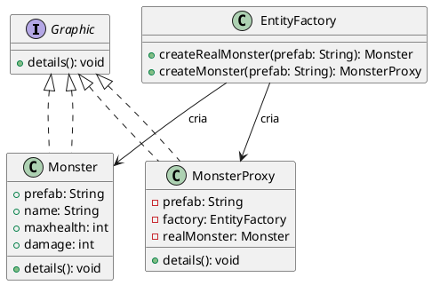

### adrão Proxy (GOF)

```markdown
# Padrão Proxy (GOF)

## Motivação

Em diversas situações, especialmente em aplicações com alto custo de criação de objetos ou que requerem controle de acesso, a criação imediata do objeto real pode ser desnecessária ou custosa. Com o Proxy, é possível adiar a criação do objeto real até o momento em que ele for realmente necessário (lazy initialization), além de permitir o controle de acesso e a inclusão de comportamentos adicionais (como logs) sem modificar a classe real. Imagine a seguir, a criação de monstros em um jogo é gerenciada por um proxy, que adia a instância real do monstro até que seus detalhes sejam solicitados. 

Suponha que estamos desenvolvendo um jogo de RPG onde os jogadores podem explorar um mundo aberto e encontrar diferentes tipos de monstros ao longo da jornada. Alguns desses monstros possuem atributos mais complexos, como habilidades especiais, animações detalhadas e inteligência artificial avançada. Criar todos esses monstros no início do jogo pode sobrecarregar os recursos do sistema e comprometer a experiência do jogador.

Com a implementação do padrão Proxy, podemos adotar uma abordagem mais eficiente: 
- Inicialmente, criamos apenas um objeto Proxy que representa cada monstro, sem carregá-lo completamente na memória.
- Somente quando o jogador interage com um monstro (por exemplo, ao se aproximar ou atacar), a instância real do monstro é criada e seus detalhes são carregados.
- Essa estratégia reduz significativamente o uso de memória e processamento, tornando o jogo mais fluido e escalável.

## Estrutura




## Solução

A implementação do padrão Proxy permite:
- **Controle de Acesso:** O proxy pode gerenciar quem ou quando pode acessar o objeto real.
- **Lazy Initialization:** A criação do objeto real é adiada até a sua real necessidade, economizando recursos.
- **Comportamento Adicional:** O proxy pode adicionar funcionalidades (como logs) sem alterar o objeto real.
- **Transparência para o Cliente:** O cliente interage com o proxy através de uma interface comum, sem precisar conhecer os detalhes de criação ou gerenciamento do objeto real.

## Participantes

- **Subject (Graphic):**  
  Define a interface comum que tanto o RealSubject quanto o Proxy implementam. Garante que o Proxy possa ser usado de forma intercambiável com o RealSubject.

- **RealSubject (Monster):**  
  Implementa a lógica principal e contém os dados reais do objeto (por exemplo, informações do monstro, como nome, vida máxima e dano).

- **Proxy (MonsterProxy):**  
  Controla o acesso ao RealSubject. Neste exemplo, implementa a criação tardia (lazy initialization) do objeto real e adiciona logs para monitoramento dos acessos.

- **EntityFactory:**  
  Facilita a criação dos objetos proxy e gerencia a instância real dos objetos quando necessário.

- **Client:**  
  Utiliza o proxy como se fosse o objeto real, sem se preocupar com a complexidade da criação e gerenciamento dos objetos.

## Implementação

```js
// Interface comum (Subject)
class Graphic {
    details() {
        throw new Error("Método 'details' deve ser implementado.");
    }
}

// Objeto real (RealSubject)
class Monster extends Graphic {
    constructor(prefab, name, maxhealth, damage) {
        super();
        this.prefab = prefab;
        this.name = name;
        this.maxhealth = maxhealth;
        this.damage = damage;
    }

    details() {
        console.log(`[Monster] ${this.prefab} information:
    Name: ${this.name}
    Max Health: ${this.maxhealth}
    Damage: ${this.damage}`);
    }
}

// Proxy (MonsterProxy)
class MonsterProxy extends Graphic {
    constructor(prefab, factory) {
        super();
        this.prefab = prefab;
        this.factory = factory;
        this.realMonster = null;
    }

    _initialize() {
        if (!this.realMonster) {
            console.log(`[Proxy] Creating real monster instance: ${this.prefab}`);
            this.realMonster = this.factory.createRealMonster(this.prefab);
        }
    }

    details() {
        this._initialize();
        this.realMonster.details();
    }
}

// Fábrica de Entidades
class EntityFactory {
    constructor() {
        this.handlePrefabs = {
            spider: () => new Monster("spider", "Spider", 100, 20),
            spider_warrior: () => new Monster("spider_warrior", "Spider Warrior", 200, 40),
            spider_hider: () => new Monster("spider_hider", "Cave Spider", 600, 20)
        };
    }

    createRealMonster(prefab) {
        return this.handlePrefabs[prefab]();
    }

    createMonster(prefab) {
        return new MonsterProxy(prefab, this);
    }
}

// Teste do padrão Proxy
const factory = new EntityFactory();
const spiderProxy = factory.createMonster("spider");
const warriorProxy = factory.createMonster("spider_warrior");

console.log("Chamando detalhes do Proxy:");
spiderProxy.details();
warriorProxy.details();
```

---
