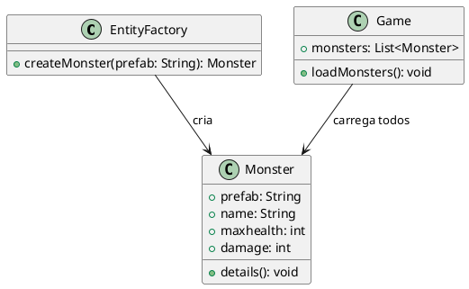

# Proxy

## Motivação

Em aplicações com alto custo de criação de objetos ou que exigem controle de acesso, a criação imediata do objeto real pode ser custosa ou desnecessária. Com o padrão Proxy, podemos adiar a criação do objeto real (lazy initialization), controlar o acesso e adicionar comportamentos complementares (como logs e cache) sem modificar a classe principal. No contexto deste exemplo, a criação de monstros em um jogo é gerenciada por um proxy que simula, de forma assíncrona, operações remotas, caching, controle de acesso e até mesmo registro de acesso (smart reference).



## Estrutura


## Solução

A implementação do padrão Proxy permite:
- **Controle de Acesso:** O proxy pode gerenciar quem ou quando pode acessar o objeto real.
- **Lazy Initialization:** A criação do objeto real é adiada até a sua real necessidade, economizando recursos.
- **Comportamento Adicional:** O proxy pode adicionar funcionalidades (como logs) sem alterar o objeto real.
- **Transparência para o Cliente:** O cliente interage com o proxy através de uma interface comum, sem precisar conhecer os detalhes de criação ou gerenciamento do objeto real.

## Participantes

- **Subject (implícito):**
As classes que fornecem o método createMonster (no caso, via ProxyEntityFactory) garantem que o cliente possa interagir sem conhecer os detalhes de criação ou controle de acesso.

- **RealSubject (Monster):**
Contém os dados reais do monstro, como prefab, nome, vida máxima e dano, além de fornecer os detalhes via o método details().

- **Proxy (ProxyEntityFactory):**
Implementa diversas funcionalidades:
  
- **Remote Proxy: Simula acesso remoto com atraso.** 
- **Virtual Proxy: Utiliza cache para evitar recriações.**
- **Protection Proxy: Restringe acesso a tipos sensíveis de monstros.**
- **Smart Reference Proxy: Registra acessos.**

- **EntityFactory:**
É responsável pela criação efetiva dos objetos do tipo Monster, armazenando funções de criação (prefabs) para cada tipo.

- **Client:**
No exemplo, o client é representado pelo código de teste que instancia o ProxyEntityFactory e realiza chamadas para criar ou acessar monstros, validando os diferentes comportamentos do Proxy.

## Implementação

```js
class Monster {
    constructor(prefab, name, maxhealth, damage) {
        this.prefab = prefab;
        this.name = name;
        this.maxhealth = maxhealth;
        this.damage = damage;
    }

    details() {
        console.log(`[Log] ${this.prefab} information:
    name: ${this.name}
    maxhealth: ${this.maxhealth}
    damage: ${this.damage}`);
    }
}

class EntityFactory {
    constructor() {
        this.handlePrefabs = {
            spider: () => new Monster("spider", "Spider", 100, 20),
            spider_warrior: () => new Monster("spider_warrior", "Spider Warrior", 200, 40),
            spider_hider: () => new Monster("spider_hider", "Cave Spider", 600, 20)
        };
    }

    async createMonster(prefab) {
        console.log(`[Factory] Creating monster: ${prefab}`);
        return this.handlePrefabs[prefab] ? this.handlePrefabs[prefab]() : null;
    }
}

class ProxyEntityFactory {
    constructor() {
        this.realFactory = new EntityFactory();
        this.monsterCache = {};
    }

    // Remote Proxy: simula uma chamada remota
    async simulateRemote(prefab) {
        console.log(`[Remote Proxy] Fetching monster data remotely for ${prefab}...`);
        return new Promise(resolve => {
            setTimeout(() => {
                console.log(`[Remote Proxy] Data received for ${prefab}.`);
                resolve();
            }, 2000);
        });
    }

    // Virtual Proxy: cria e guarda o monstro para evitar recriações
    async createMonster(prefab) {
        if (!this.monsterCache[prefab]) {
            await this.simulateRemote(prefab);
            this.monsterCache[prefab] = await this.realFactory.createMonster(prefab);
        } else {
            console.log(`[Virtual Proxy] Returning cached monster: ${prefab}`);
        }
        return this.monsterCache[prefab];
    }

    // Protection Proxy: verifica se o usuário tem privilégios para criar certos monstros
    async createProtectedMonster(prefab, userRole) {
        if (userRole !== 'admin' && prefab === 'spider_hider') {
            console.log(`[Protection Proxy] Access denied to create ${prefab}. Requires admin privileges.`);
            return null;
        }
        return await this.createMonster(prefab);
    }

    // Smart Reference Proxy: registra o acesso ao monstro
    async accessMonster(prefab) {
        console.log(`[Smart Reference] Monster ${prefab} was accessed.`);
        return await this.createMonster(prefab);
    }
}

(async () => {
    const proxyFactory = new ProxyEntityFactory();

    console.log("\n[TEST] Creating spider via proxy");
    const spider = await proxyFactory.createMonster('spider');

    console.log("\n[TEST] Creating spider again to test caching");
    const spider2 = await proxyFactory.createMonster('spider');

    console.log("\n[TEST] Creating spider_hider with protection proxy (user: guest)");
    const spiderHider = await proxyFactory.createProtectedMonster('spider_hider', 'guest');

    console.log("\n[TEST] Creating spider_hider with protection proxy (user: admin)");
    const spiderHiderAdmin = await proxyFactory.createProtectedMonster('spider_hider', 'admin');

    console.log("\n[TEST] Accessing spider via smart reference proxy");
    await proxyFactory.accessMonster('spider');
})();

```

