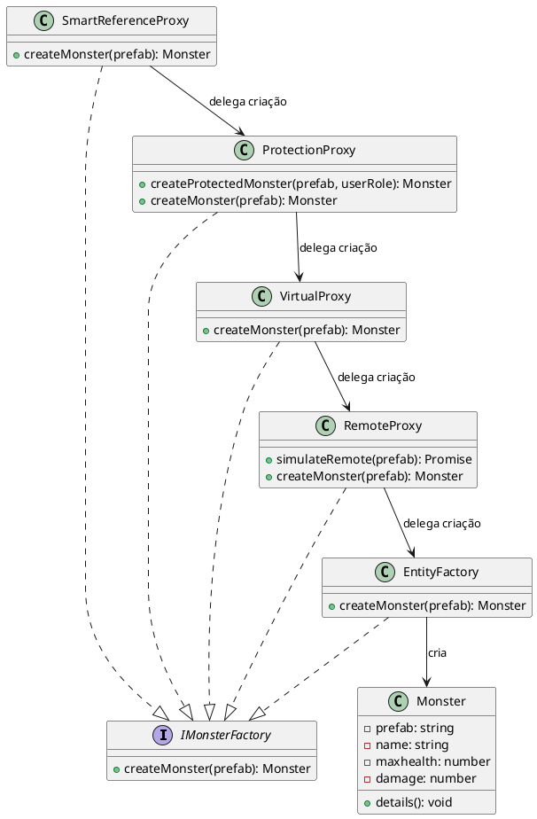

# Proxy


## Motivação

Em diversas situações, especialmente em aplicações com alto custo de criação de objetos ou que requerem controle de acesso, a criação imediata do objeto real pode ser desnecessária ou custosa. Com o Proxy, é possível adiar a criação do objeto real até o momento em que ele for realmente necessário (lazy initialization), além de permitir o controle de acesso e a inclusão de comportamentos adicionais (como logs) sem modificar a classe real. Imagine a seguir, a criação de monstros em um jogo é gerenciada por um proxy, que adia a instância real do monstro até que seus detalhes sejam solicitados:

Nesse cenário, suponha que estamos desenvolvendo um jogo de RPG onde os jogadores podem explorar um mundo aberto e encontrar diferentes tipos de monstros ao longo da jornada. Alguns desses monstros possuem atributos mais complexos, como habilidades especiais, animações detalhadas e inteligência artificial avançada. Criar todos esses monstros no início do jogo pode sobrecarregar os recursos do sistema e comprometer a experiência do jogador.



## Proxies

### Remote Proxy
Este Remote Proxy simula a obtenção de dados de um servidor antes de criar um monstro. Isso pode ser útil em sistemas distribuídos ou para carregar configurações de um banco de dados remoto.

```js
async simulateRemote(prefab) {
    console.log(`[Remote Proxy] Fetching monster data remotely for ${prefab}...`);
    return new Promise(resolve => {
        setTimeout(() => {
            console.log(`[Remote Proxy] Data received for ${prefab}.`);
            resolve();
        }, 2000);
    });
}
```


### Virtual Proxy
O Virtual Proxy implementa um cache(memória) para evitar a criação repetida de objetos idênticos. Se o monstro já foi criado anteriormente, ele reutiliza a instância existente, melhorando a performance.

```js
async createMonster(prefab) {
    if (!this.monsterCache[prefab]) {
        await this.simulateRemote(prefab); 
        this.monsterCache[prefab] = await this.realFactory.createMonster(prefab);
    } else {
        console.log(`[Virtual Proxy] Returning cached monster: ${prefab}`);
    }
    return this.monsterCache[prefab];
}
```


### Protection Proxy
O Protection Proxy impede que usuários sem privilégios administrativos criem certos tipos de monstros. Aqui, apenas administradores podem criar o 'spider_hider'.

```js
async createProtectedMonster(prefab, userRole) {
    if (userRole !== 'admin' && prefab === 'spider_hider') {
        console.log(`[Protection Proxy] Access denied to create ${prefab}. Requires admin privileges.`);
        return null;
    }
    return await this.createMonster(prefab);
}
```


### Smart Reference Proxy
O Smart Reference Proxy adiciona funcionalidades como logs e monitoramento de acessos. Sempre que um monstro for acessado, uma mensagem será registrada no LOG.

```js
async accessMonster(prefab) {
    console.log(`[Smart Reference] Monster ${prefab} was accessed.`);
    return await this.createMonster(prefab);
}
```


## Solução

A implementação do padrão Proxy permite:
- **Controle de Acesso:** O proxy pode gerenciar quem ou quando pode acessar o objeto real.
- **Lazy Initialization:** A criação do objeto real é adiada até a sua real necessidade, economizando recursos.
- **Comportamento Adicional:** O proxy pode adicionar funcionalidades (como logs) sem alterar o objeto real.
- **Transparência para o Cliente:** O cliente interage com o proxy através de uma interface comum, sem precisar conhecer os detalhes de criação ou gerenciamento do objeto real.
- **Segurança:** Executando controles de acesso e sistemas de permissões.


## Participantes

- **Subject (IMonsterFactory.)**
Ela define o método createMonster(prefab) que tanto o RealSubject quanto todos os proxies implementam, garantindo uma interface comum.

- **RealSubject:**
Representado pela classe EntityFactory.
Essa classe contém a lógica real para criar os objetos do tipo Monster e é responsável por instanciar os monstros conforme os prefabs.

- **Proxy:**
São classes que implementam a mesma interface (ou seja, o Subject) e controlam o acesso ao RealSubject, adicionando comportamentos adicionais. No código, temos diversas variações:

- **Remote Proxy (RemoteProxy):** Simula o acesso remoto, adicionando uma latência (através de setTimeout) antes de delegar a criação do monstro.
  
- **Virtual Proxy (VirtualProxy):** Implementa um cache dos monstros, evitando a recriação desnecessária de objetos já instanciados.

- **Protection Proxy (ProtectionProxy):** Controla o acesso à criação de determinados monstros (por exemplo, restringe a criação do monstro "spider_hider" para usuários sem privilégios de admin).

- **Smart Reference Proxy (SmartReferenceProxy):** Adiciona funcionalidades extras (como logging) cada vez que o monstro é acessado.


## Implementação

```js
// Interface: define a operação que todas as fábricas/proxies devem implementar.
class IMonsterFactory {
    async createMonster(prefab) {
        throw new Error("Método createMonster() deve ser implementado.");
    }
}

// Real Subject: Fábrica real que cria os monstros.
class EntityFactory extends IMonsterFactory {
    constructor() {
        super();
        this.handlePrefabs = {
            spider: () => new Monster("spider", "Spider", 100, 20),
            spider_warrior: () => new Monster("spider_warrior", "Spider Warrior", 200, 40),
            spider_hider: () => new Monster("spider_hider", "Cave Spider", 600, 20)
        };
    }

    async createMonster(prefab) {
        console.log(`[Factory] Criando monstro: ${prefab}`);
        return this.handlePrefabs[prefab] ? this.handlePrefabs[prefab]() : null;
    }
}

// Classe base Monster
class Monster {
    constructor(prefab, name, maxhealth, damage) {
        this.prefab = prefab;
        this.name = name;
        this.maxhealth = maxhealth;
        this.damage = damage;
    }

    details() {
        console.log(`[Log] Informações de ${this.prefab}:\n  Nome: ${this.name}\n  Vida Máxima: ${this.maxhealth}\n  Dano: ${this.damage}`);
    }
}

// Proxy que simula acesso remoto (Remote Proxy)
class RemoteProxy extends IMonsterFactory {
    constructor(factory) {
        super();
        this.factory = factory;
    }

    async simulateRemote(prefab) {
        console.log(`[Remote Proxy] Buscando dados do monstro ${prefab} remotamente...`);
        return new Promise(resolve => {
            setTimeout(() => {
                console.log(`[Remote Proxy] Dados recebidos para ${prefab}.`);
                resolve();
            }, 2000);
        });
    }

    async createMonster(prefab) {
        await this.simulateRemote(prefab);
        return this.factory.createMonster(prefab);
    }
}

// Proxy que faz cache da criação (Virtual Proxy)
class VirtualProxy extends IMonsterFactory {
    constructor(factory) {
        super();
        this.factory = factory;
        this.monsterCache = {};
    }

    async createMonster(prefab) {
        if (!this.monsterCache[prefab]) {
            this.monsterCache[prefab] = await this.factory.createMonster(prefab);
        } else {
            console.log(`[Virtual Proxy] Retornando monstro em cache: ${prefab}`);
        }
        return this.monsterCache[prefab];
    }
}

// Proxy que controla acesso (Protection Proxy)
class ProtectionProxy extends IMonsterFactory {
    constructor(factory) {
        super();
        this.factory = factory;
    }

    async createProtectedMonster(prefab, userRole) {
        if (userRole !== 'admin' && prefab === 'spider_hider') {
            console.log(`[Protection Proxy] Acesso negado para criar ${prefab}. Requer privilégios de admin.`);
            return null;
        }
        return this.factory.createMonster(prefab);
    }

    async createMonster(prefab) {
        return this.factory.createMonster(prefab);
    }
}


class SmartReferenceProxy extends IMonsterFactory {
    constructor(factory) {
        super();
        this.factory = factory;
    }

    async createMonster(prefab) {
        console.log(`[Smart Reference Proxy] O monstro ${prefab} foi acessado.`);
        return this.factory.createMonster(prefab);
    }
}

const realFactory = new EntityFactory();
const remoteProxy = new RemoteProxy(realFactory);
const virtualProxy = new VirtualProxy(remoteProxy);
const protectionProxy = new ProtectionProxy(virtualProxy);
const smartReferenceProxy = new SmartReferenceProxy(protectionProxy);

(async () => {
    console.log("\n[TESTE] Criando 'spider' via cadeia de proxies");
    let spider = await smartReferenceProxy.createMonster('spider');
    spider.details();

    console.log("\n[TESTE] Criando 'spider' novamente para testar o cache (Virtual Proxy)");
    let spider2 = await smartReferenceProxy.createMonster('spider');
    spider2.details();

    console.log("\n[TESTE] Tentando criar 'spider_hider' com proteção (usuário: guest)");
    // Utilizando o ProtectionProxy diretamente para incluir a verificação de acesso.
    let spiderHider = await protectionProxy.createProtectedMonster('spider_hider', 'guest');
    if (spiderHider) {
        spiderHider.details();
    }

    console.log("\n[TESTE] Criando 'spider_hider' com proteção (usuário: admin)");
    let spiderHiderAdmin = await protectionProxy.createProtectedMonster('spider_hider', 'admin');
    if (spiderHiderAdmin) {
        spiderHiderAdmin.details();
    }

    console.log("\n[TESTE] Acessando 'spider' via Smart Reference Proxy");
    let accessedSpider = await smartReferenceProxy.createMonster('spider');
    accessedSpider.details();
})();

```

---
